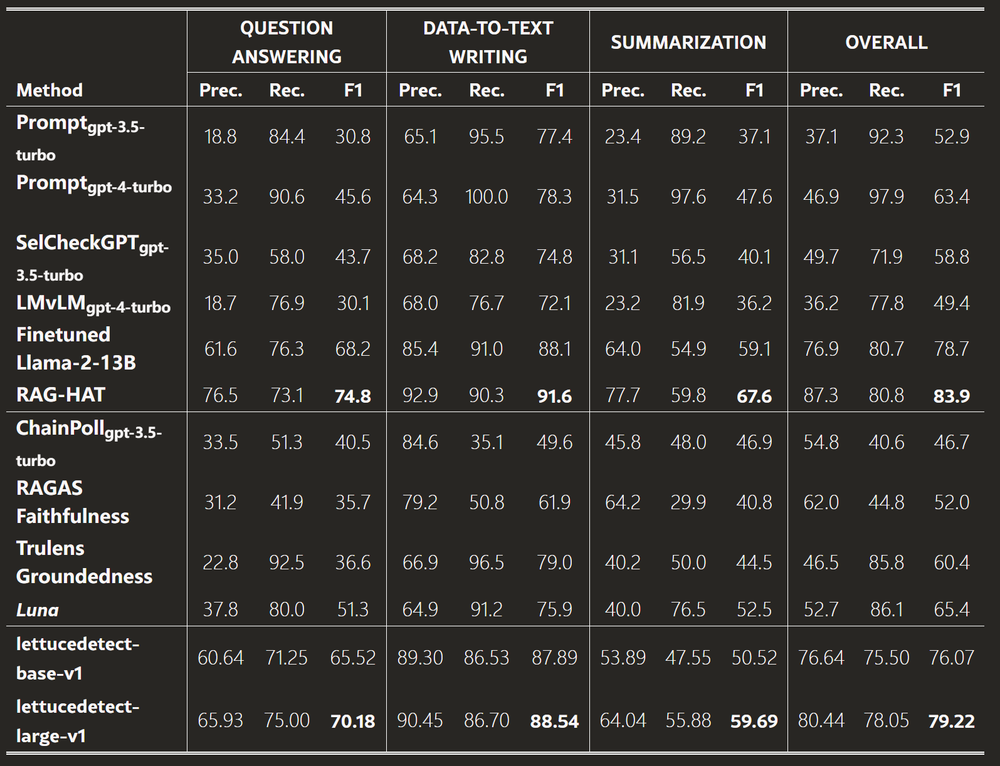
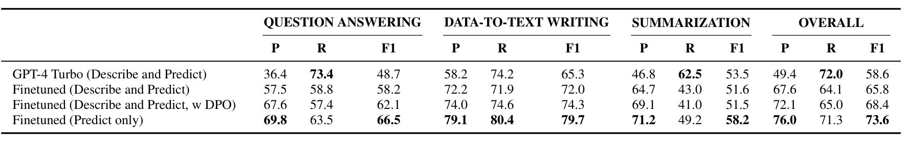

# RAG Hallucination：当“插入无关文档”成为常态

## 1) Observation
- **RAG 会改变原始上下文分布**：检索到的外部文本进入 prompt，使生成不再仅由用户 query 决定，而是受到“context”强约束。
- 这种改变的初衷通常是 **降低 hallucination**（通过 grounding truth / domain-specific decuments 组成 context 的 ICL）.  
  - Insight：但 **RAG-style contexts 可能削弱鲁棒性与安全防护**，引入新的安全风险与失败模式。
  - Paper: *RAG Makes Guardrails Unsafe? Investigating Robustness of Guardrails under RAG-style Contexts*。

## 2) Trend：向 RAG 知识库插入“垂直知识无关/任务无关”文档
- 越来越多研究为了隐私、安全、公平、知识边界等目标，**主动向 RAG 数据集/知识库插入“无害但与主任务无关”的文本**。
- 这类插入往往被视为“正向增强/防护”，但同时引出关键担忧：
  - **插入导致的偏向（bias shift）是否会改变 hallucination 行为？**
  - 是否会产生新的 **不稳定性**（inconsistency）或 **上下文诱导幻觉**（context-induced hallucination）？

---

## 3) Case Studies：插入无关文档的正向动机与效果

### Case 1：为缓解 RAG 的 Fairness Issue
- *Your RAG is Unfair: Exposing Fairness Vulnerabilities in Retrieval-Augmented Generation*  
  - 指出：RAG 系统存在 **unfair generation** 的结构性风险（检索偏差→生成偏差）。
- *FairRAG: Fair Human Generation via Fair Retrieval Augmentation*  
  - 方法：向知识库/检索增强内容中插入（或构造）**公平相关参考文档**，通过“fair retrieval augmentation”缓解不公平生成。

**Takeaway**：通过“插入/加入公平文档”改变检索分布，从而改变生成分布。

### Case 2：To secure RAG（数据集保护/反恶意检索）
- *Dataset Protection via Watermarked Canaries in Retrieval-Augmented LLMs*  
  - 方法：向知识库插入 **保护性水印/金丝雀文档**，用于检测或阻断恶意检索/数据窃取。

**Takeaway**：插入“无害文本”作为防护机制，改变检索与审计信号。

### Case 3：实现知识边界约束 / Unlearning
- *When Machine Unlearning Meets Retrieval-Augmented Generation (RAG): Keep Secret or Forget Knowledge?*  
  - 方法：向 RAG 中插入 **提示性/约束性文档**，通过检索上下文实现知识边界控制，达到类似 unlearning 的效果。

**Takeaway**：插入约束文档，使 RAG 的“可生成知识空间”被显式重塑。

---

## 4) 与 Poisoning Attack 的关系：相似操作、不同意图
- **正向插入**（privacy / fairness / security / boundary）与 **poisoning attack against RAG** 相似：  
  - 都假设攻击者/设计者能够在构建向量库前 **访问并修改数据集**（access dataset before building vector dataset）。
- 典型 poisoning attack 的 mitigations：
  - **chunk rewriting**（重写片段、降低可触发性）
  - **reranking**（重排降低恶意片段入 top-k 概率）
  - **content filter**（过滤敏感/可疑内容）

---

## 5) New Concern：防御与“无关文档插入”可能引发的 Hallucination 代价
- 现有防御思路往往通过 **semantic 扰动**破坏 poisoned document 的触发条件/语义完整性来降低攻击成功率。
- 但这会引出两个关键风险假设：

### Motivation：错误或有偏见的检索可能误导生成，加剧幻觉(下面论文观点，需要实验证明)

 - Paper 1: Removal of Hallucination on Hallucination: Debate-Augmented RAG (DRAG)

 - Paper 2: RAGTruth: A Hallucination Corpus for Developing Trustworthy Retrieval-Augmented Language Models

 - Paper 3: LettuceDetect: A Hallucination Detection Framework for RAG Applications

 - Paper 4: ReEval: Automatic Hallucination Evaluation for Retrieval-Augmented Large Language Models via Transferable Adversarial Attacks (精确匹配（EM）准确性、token-level F1和 entailment accuracy)

 - Paper 5: ReDeEP: Detecting Hallucination in Retrieval-Augmented Generation via Mechanistic Interpretability (仅给出一种幻觉检测方法，没有LLM和RAG中幻觉对比，也没有QA任务和Summary任务实验结果可对比，尽管Dolly(AC)中含有summary数据集)

### Concern A：防御是否会增加 hallucination、降低性能？
- chunk rewriting / aggressive filtering / reranking 可能导致：
  - **证据缺失**（context drop）→ 生成不得不“补全” → hallucination↑
  - **检索召回下降**（recall↓）→ groundedness↓ → 质量下降

### Concern B：无害“无关文档”是否能绕过防御（non-malicious bypass）？
- 如果防御器主要针对“明显恶意/poisoned”的语义特征，那么：
  - 插入 **非恶意但无关** 的文档，不受语义过滤器的阻拦，进入 context，可能造成：
    - **上下文信息缺失**（information loss in context）
    - **guardrail bypass 的间接路径**（是否有可能通过无关文档绕过防御策略从而实现攻击 → Backdoor = Σ(sub-backdoors)）
- 这与“正向插入”趋势叠加，使得系统更难区分：
  - **防护性插入** vs **攻击性插入** vs **无害噪声插入**

---

## 6) Research Gap
- 现有工作分别研究了：
  - RAG 上下文对 guardrails/robustness 的影响
  - 插入文档用于 fairness / privacy / security / boundary 的正向收益
  - poisoning attack 与对应 mitigations（rewriting/reranking/filtering）
- **缺少统一视角**：  
  - “向知识库插入无关文档（无论善意还是恶意）”对 **hallucination** 的影响评估：
    - hallucination rate / groundedness / citation correctness
    - 与防御机制耦合后的性能-安全权衡（security–utility trade-off）
    - 防御是否可被“无害无关文档”绕过（benign-context bypass）

## 7) Q
- 当“插入无关文档”成为常见的 RAG 增强/防护手段时：
  1. 现有 anti-poisoning 防御（rewriting/reranking/filtering）是否会 **以 hallucination 增加为代价**？
  2. 是否存在一种 **benign irrelevant insertion**，能在不触发恶意检测的情况下 **bypass 防御**，导致安全与可靠性同时下降？

---

# 现有 Hallucination Detection/Evaluation on LLM 不适用于 RAG

传统的 LLM Hallucination Evaluation 并不适合 RAG 中的幻觉评估。当前 hallucination detection 的方法常常基于 QA 数据集，但是 RAG 的多源输入特性使得 **summary 数据集**更适合 evaluate the hallucination in RAG。

## LLM vs RAG：输入形式差异
- **LLM**：  
  `input → (LLM) → output`

- **RAG**：  
  `input + R(chunk 1 + chunk 2 + ... + chunk k) → (Generator) → output`

这种特性使两者的 hallucination 存在偏差。

## Insight
现有的 hallucination detection 迁移到 RAG 上，在 summary 数据集上表现极差，正是因为 RAG 的多源输入特性与 LLM 的单源输入假设不匹配。

## Related Work
- Paper: **RAG LettuceDetect: A Hallucination Detection Framework for RAG Applications**
- 
- Paper: **RAG-HAT**
- 

